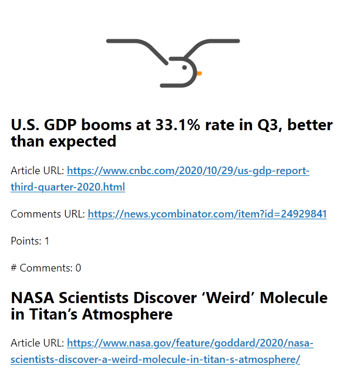

# goeland


[](https://travis-ci.com/slurdge/goeland)


[](https://github.com/slurdge/goeland/actions/workflows/docker.yml)

A RSS to email, ala rss2email written in Go.

Support this project by giving it a ⭐️ and sharing it.

## About

Goeland excels at creating beautiful emails from RSS, tailored for daily or weekly digest.

It include a number of filters (see below) that can transform the RSS content along the way. It can also consume other sources, such as a Imgur tag.

Goeland transforms this...

```xml
<rss version="2.0" xmlns:dc="http://purl.org/dc/elements/1.1/" xmlns:atom="http://www.w3.org/2005/Atom"><channel><title>Hacker News: Newest</title><link>https://news.ycombinator.com/newest</link><description>Hacker News RSS</description><docs>https://hnrss.org/</docs><generator>go-hnrss v1.0-10-g4f1b850</generator><lastBuildDate>Thu, 29 Oct 2020 12:42:05 +0000</lastBuildDate><atom:link href="https://hnrss.org/newest" rel="self" type="application/rss+xml"></atom:link><item><title><![CDATA[U.S. GDP booms at 33.1% rate in Q3, better than expected]]></title><description><![CDATA[
<p>Article URL: <a href="https://www.cnbc.com/2020/10/29/us-gdp-report-third-quarter-2020.html">https://www.cnbc.com/2020/10/29/us-gdp-report-third-quarter-2020.html</a></p>
<p>Comments URL: <a href="https://news.ycombinator.com/item?id=24929841">https://news.ycombinator.com/item?id=24929841</a></p>
<p>Points: 1</p>
<p># Comments: 0</p>
]]></description><pubDate>Thu, 29 Oct 2020 12:39:15 +0000</pubDate><link>https://www.cnbc.com/2020/10/29/us-gdp-report-third-quarter-2020.html</link><dc:creator>kjhughes</dc:creator><comments>https://news.ycombinator.com/item?id=24929841</comments><guid isPermaLink="false">https://news.ycombinator.com/item?id=24929841</guid></item><item><title><![CDATA[NASA Scientists Discover ‘Weird’ Molecule in Titan’s Atmosphere]]></title><description><![CDATA[
<p>Article URL: <a href="https://www.nasa.gov/feature/goddard/2020/nasa-scientists-discover-a-weird-molecule-in-titan-s-atmosphere/">https://www.nasa.gov/feature/goddard/2020/nasa-scientists-discover-a-weird-molecule-in-titan-s-atmosphere/</a></p>
<p>Comments URL: <a href="https://news.ycombinator.com/item?id=24929819">https://news.ycombinator.com/item?id=24929819</a></p>
<p>Points: 1</p>
<p># Comments: 2</p>
]]></description><pubDate>Thu, 29 Oct 2020 12:36:38 +0000</pubDate><link>https://www.nasa.gov/feature/goddard/2020/nasa-scientists-discover-a-weird-molecule-in-titan-s-atmosphere/</link><dc:creator>Kaibeezy</dc:creator><comments>https://news.ycombinator.com/item?id=24929819</comments><guid isPermaLink="false">https://news.ycombinator.com/item?id=24929819</guid></item><item><title><![CDATA[Automation Tools for FinTech Startups]]></title><description><![CDATA[
<p>Article URL: <a href="https://www.ego-cms.com/post/5-fintech-automation-features-to-win-customer-trust-with">https://www.ego-cms.com/post/5-fintech-automation-features-to-win-customer-trust-with</a></p>
<p>Comments URL: <a href="https://news.ycombinator.com/item?id=24929801">https://news.ycombinator.com/item?id=24929801</a></p>
<p>Points: 1</p>
<p># Comments: 0</p>
]]></description><pubDate>Thu, 29 Oct 2020 12:34:16 +0000</pubDate><link>https://www.ego-cms.com/post/5-fintech-automation-features-to-win-customer-trust-with</link><dc:creator>_Tata_</dc:creator><comments>https://news.ycombinator.com/item?id=24929801</comments><guid isPermaLink="false">https://news.ycombinator.com/item?id=24929801</guid></item><item><title><![CDATA[Preparing for the Docker Hub Rate Limits]]></title><description><![CDATA[
<p>Article URL: <a href="https://inlets.dev/blog/2020/10/29/preparing-docker-hub-rate-limits.html">https://inlets.dev/blog/2020/10/29/preparing-docker-hub-rate-limits.html</a></p>
<p>Comments URL: <a href="https://news.ycombinator.com/item?id=24929792">https://news.ycombinator.com/item?id=24929792</a></p>
<p>Points: 1</p>
<p># Comments: 1</p>
]]></description>
```

into this



Also works with dark theme and tablet/phone email clients.

## Installation

Grab the latest binary release from the [release page](https://github.com/slurdge/goeland/releases/latest/).
Binaries are available for the following platforms:

* linux/386
* linux/amd64
* linux/arm
* linux/arm64
* darwin/amd64
* windows/amd64
* windows/386

Just put it in a folder where you have write permissions and run it first with :

```console
goeland run
```

## Usage

On first run, if it doesn't exist yet, goeland will create a `config.toml` with the default values. You need to adjust the `[email]` section with your SMTP server details.

### Sources

Afterwards, fill the `[sources]` and `[pipes]` sections.
Source are identified by their name after the `[source.]` field:

```toml
[sources.hackernews]
type = "feed"
url = "https://hnrss.org/newest"
filters = ["all", "today"]
```

You can then use `'hackernews'` in the following pipes.

The different source types are:

* `"feed"`: Regular RSS feed. Fill in the `url` field
* `"imgur"`: Return most recent results for a tag. Fill in the the `tag` field.
* `"merge"`: Will merge two or more sources together. Fill in the `sources` field with a list of sources: `sources = ["source1", "source2"]`. Especially useful to merge different sources on the same topic. Don't forget to `digest` or `combine` it later.

### Filtering

One powerful aspect of goeland is filtering. Instead of sending the content of the RSS directly to the email system, it can transform it in a number of ways in order to make it easier to read, process, etc.

Any number of filters can be defined, the order is important. For example, the following:

```toml
filters = ["unseen", "lebrief", "digest"]
```

Will first keep only previously `unseen` entries, then transform it nicer with `lebrief` filter, and, at last, will put them all together with `digest`. This will create only one email with a SourceTitle as the title of the RSS feed.

The available filters are as follow:

* none: Removes all entries
* all: Default, include all entries

* first: Keep only the first entry
* last: Keep only the last entry
* reverse: Reverse the order of the entries
* random: Keep 1 or more random entries. Use either 'random' or 'random(5)' for example.
* unseen: Keep only unseen entry. Entries that have been seen will be put in a `goeland.db` file. Use the `purge` command to remove seen entries.
* today: Keep only the entries for today
* lasthours: Keep only the entries that are from the X last hours (default 24)
* digest: Make a digest of all entries (optional heading level, default is 2)
* combine: Combine all the entries into one source and use the first entry title as source title. Useful for merge sources
* links: Rewrite relative links src="// and href="// to have an https:// prefix
* embedimage: Embed a picture if the entry has an attachment with a type of picture (optional position: top|bottom|left|right, default is top)
* replace: Replace a string with another. Use with an argument like this: replace(myreplace) and define

```toml
[replace.myreplace]
        from="A string"
        to="Another string"
```

in your config file.

* includelink: Include the link of entries in the digest form
* lebrief: Retrieves the full excerpts for Next INpact's Lebrief. Use only with a source from Next INpact.
* language: Keep only the specified languages (best effort detection), use like this: `language(en,de)`

### Pipes

After defining a number of sources, you can send them to a pipe. One source can be send to multiple pipes, but a pipe can only have one source. If you need to combine sources together, use the above special `merge` type to have this effect.

A pipe has the following structure:

```toml
[pipes.hackernews]
source = "hackernews"
destination = "email"
email_to = "example@example.com"
email_from = "HackerNews <goeland@example.com>"
email_title = "{{.EntryTitle}}"
```

You can use EntryTitle, SourceTitle and SourceName in the email template. SourceTitle is the title of the RSS stream.

For debug purposes, or in order to pipe in other systems, you can set destination to `terminal`.

### Email

In the email section you need to specify your outgoing mail server. From 0.8.0, you can specify both `encryption` and `allow-insecure` to connect to self hosted servers. You can also specify `authentication` to select the appropriate option for your server ( the options available are `"none"`, `"plain"`, `"login"` and `"crammd5"`; if unspecified it defaults to `"plain"`; see [`go-simple-mail`](https://pkg.go.dev/github.com/xhit/go-simple-mail/v2#AuthType)'s documentation for details).

```toml
[email]
host = "smtp.example.com"
port = 25
username = "default"
password = "p4ssw0rd"
encryption = "tls"
allow-insecure = false
authentication = "plain"
#Email customization
include-header = true
include-footer = true
#footer = Your custom footer
#logo = internal:goeland.png
#template = /path/to/template.html
```

## Examples

This will bring you 6 puppies to your inbox.

```toml
loglevel = "info"
dry-run = false

[email]
host = "smtp.sendgrid.net"
port = 587
username = "apikey"
password = "<sendgridapikey>"

[sources]

[sources.insta]
url = "https://rssbridge.example.com/?action=display&bridge=Instagram&context=Hashtag&h=puppy&media_type=picture&direct_links=on&format=MRss"
type = "feed"
filters = ["random(3)"]

[sources.imgur]
type = "imgur"
tag = "puppy"
filters = ["random(3)"]

[sources.puppies]
type = "merge"
sources = ["insta", "imgur"]
filters = ["combine"]

[pipes]

[pipes.puppies]
source = "puppies"
destination = "email"
email_to = ["puppylover@example.com"]
email_from = "DailyPuppy <goeland@example.com>"
```

This will give you the latest article on a specific subreddit:

```toml
loglevel = "none"
dry-run = false
database = "goeland.db"

[email]
host = "example.com"
port = 25
username = "username"
password = "password"

[sources]

[sources.reddit]
url = "https://www.reddit.com/r/selfhosted/top.rss"
type = "feed"
filters = ["unseen", "includelink", "digest"]

[pipes.reddit]
source = "reddit"
destination = "email"
email_to = ["example@example.com"]
email_from = "Reddit <reddit@example.com>"
```

It is possible to send an email to multiple addresses, just put them in a list:

```toml
[pipes.reddit]
source = "reddit"
destination = "email"
email_to = ["bob@example.com", "alice@gmail.com", "charles@yahoo.com"]
email_from = "Reddit <reddit@example.com>"
```

See also the `examples/` folder.

## Contributing

Feel free to open bugs or PR for more sources, more filters suggestions.

If you encounter a problematic feed, please open a bug with the content of the feed attached.

## Future

Here is a list of things that could be nice

* image inliner
* embedded scripting language for filters&manipulation
* remove tags for instagram
* footer text
* use enclosure of the feed as header image
* <https://github.com/go-shiori/go-readability>
