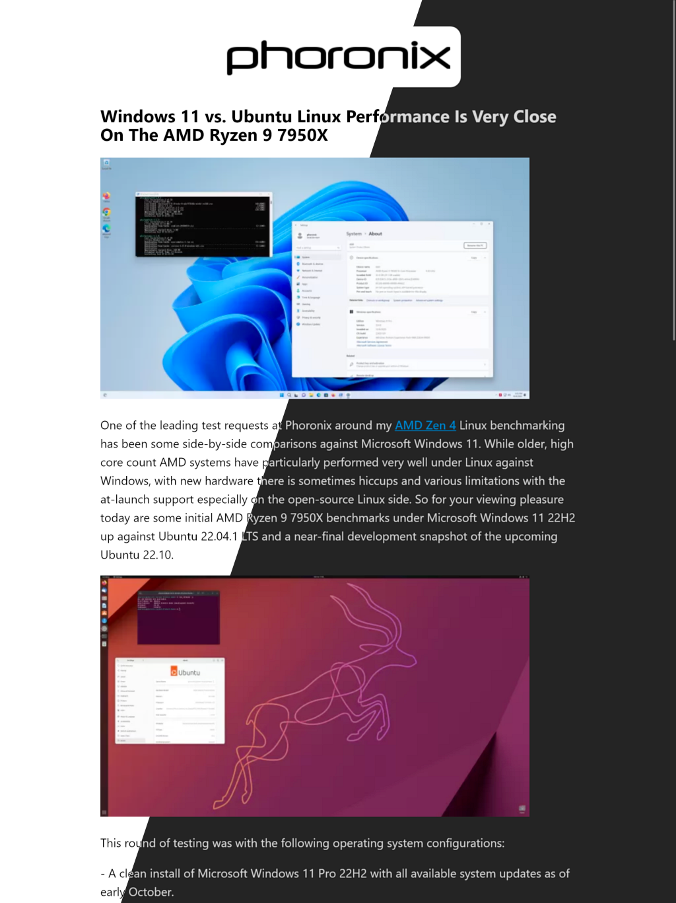
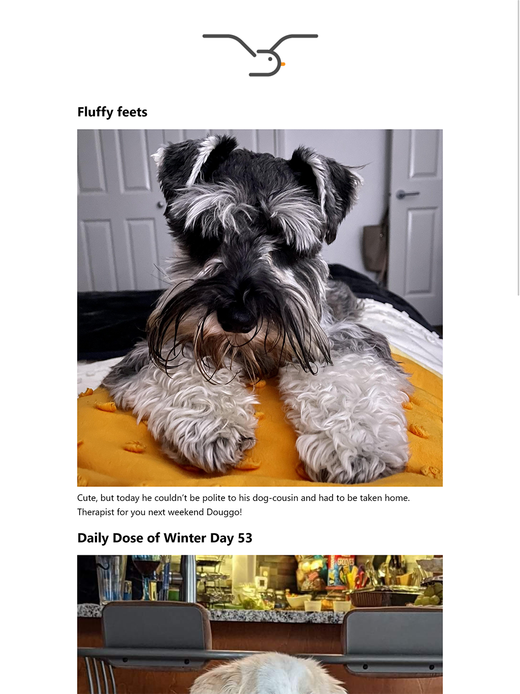

# goeland


[](https://github.com/slurdge/goeland/actions/workflows/build.yml)
[](https://github.com/slurdge/goeland/actions/workflows/docker.yml)


> Turn any RSS/Atom feed into a beautiful email digest — self-hosted, no cloud required.

Support this project by giving it a ⭐️ and sharing it.

## Features

- **Beautiful HTML emails** — responsive template for mobile, tablet, desktop, and webmail clients
- **Full-text extraction** — fetch and embed complete article content, not just summaries
- **20+ composable filters** — `unseen`, `today`, `retrieve`, `digest`, `language`, `reskip`, and more
- **Built-in scheduler** — per-pipe cron scheduling in daemon mode, no external cron needed
- **Multiple source types** — RSS/Atom/JSON feeds, Imgur tags, [Miniflux](https://miniflux.app) instances, and merged/combined sources
- **Docker-native** — single container, one config file, ready to self-host
- **Zero cloud dependency** — your feeds, your server, your inbox

## Contents

- [About](#about)
- [Status](#status)
- [Installation](#installation)
- [Docker](#docker)
- [Usage](#usage)
  - [Sources](#sources)
  - [Filtering](#filtering)
  - [Pipes](#pipes)
  - [HTML file output](#html-file-output)
  - [Scheduling](#scheduling)
  - [Email](#email)
  - [Rate limiting](#rate-limiting)
- [Examples](#examples)
- [Contributing](#contributing)
- [Roadmap](#roadmap)

## About

Goeland excels at creating beautiful emails from RSS feeds, tailored for daily or weekly digests.
It includes a rich set of composable filters that transform feed content along the way, and can also consume other sources such as Imgur tags.

Goeland transforms this...

```xml
<rss version="2.0">
<channel>
<title>Phoronix</title>
<link>https://www.phoronix.com/</link>
<description>
Linux Hardware Reviews, Benchmarks & Open-Source News
</description>
<language>en-us</language>
<item>
<title>
Google Announces KataOS As Security-Focused OS, Leveraging Rust & seL4 Microkernel
</title>
<link>https://www.phoronix.com/news/Google-KataOS</link>
<guid>https://www.phoronix.com/news/Google-KataOS</guid>
<description>
Google this week has announced the release of KataOS as their newest operating system effort focused on embedded devices running ambient machine learning workloads. KataOS is security-minded, exclusively uses the Rust programming language, and is built atop the seL4 microkernel as its foundation...
</description>
<pubDate>Sun, 16 Oct 2022 06:10:25 -0400</pubDate>
</item>
</rss>
```

into this



## Status

Goeland is used in production with many email clients, and has sent over thousands of emails. It is considered stable.

## Installation

Grab the latest binary from the [release page](https://github.com/slurdge/goeland/releases/latest/).
Binaries are available for the following platforms:

* linux/386
* linux/amd64
* linux/arm
* linux/arm64
* darwin/amd64
* windows/amd64
* windows/386

Just put it in a folder where you have write permissions and run it first with :

```console
goeland run
```

If you need support for another platform, please open a PR or submit a feature request.

## Docker

Images are published to both Docker Hub and GHCR for `linux/amd64`, `arm64`, `arm/v6`, and `arm/v7`:

```bash
docker run -v ./config.toml:/data/config.toml slurdge/goeland
# or
docker run -v ./config.toml:/data/config.toml ghcr.io/slurdge/goeland
```

The default command is `daemon` — the container runs continuously and dispatches pipes on their configured cron schedules. Mount the database file to persist the `unseen` filter state across restarts:

```yaml
# docker-compose.yml
services:
  goeland:
    image: ghcr.io/slurdge/goeland
    volumes:
      - ./config.toml:/data/config.toml
      - ./goeland.db:/data/goeland.db
    restart: unless-stopped
```

## Usage

On first run, goeland creates a `config.toml` with default values if one does not exist. Adjust the `[email]` section with your SMTP details.
All config values can also be set via environment variables (e.g. `GOELAND_EMAIL_PASSWORD_FILE=/path/to/pass`).

### Sources

Define sources in the `[sources]` section. Each source is identified by its key name:

```toml
[sources.hackernews]
type = "feed"
url = "https://hnrss.org/newest"
filters = ["all", "today"]
```

You can then use `'hackernews'` in the following pipes.

The different source types are:

* `"feed"`: RSS, Atom or JSON feed (all supported formats can be found [here](https://github.com/mmcdole/gofeed#supported-feed-types)). Fill in the `url` field.
* `"imgur"`: Return most recent results for a tag. Fill in the `tag` field.
* `"miniflux"`: Fetch entries from a [Miniflux](https://miniflux.app) instance through its REST API. Fill in the `url` field with an API URL — see [Miniflux](#miniflux) below.
* `"merge"`: Will merge two or more sources together. Fill in the `sources` field with a list of sources: `sources = ["source1", "source2"]`. Especially useful to merge different sources on the same topic. Don't forget to `digest` or `combine` it later.

#### Miniflux

The `miniflux` source type reads entries straight from a (usually self-hosted) [Miniflux](https://miniflux.app) instance using its [REST API](https://miniflux.app/docs/api.html). Any feed, category, search, or starred list you already curate in Miniflux can become an email digest.

First create an API key in Miniflux under **Settings → API Keys** and add it at the top level of your goeland config (or set the `GOELAND_MINIFLUX_API_TOKEN` environment variable):

```toml
miniflux-api-token = "your-api-key"
```

If you use several Miniflux instances, set `api-token` inside a source block to override the global token for that source.

The source `url` is a Miniflux **API** URL, not a web UI URL. Translating from what you see in your browser is mechanical: insert `/v1`, pluralize `feed`/`category`, and express everything else as query parameters.

| What you want | Web UI URL looks like | API `url` to use in goeland |
|---------------|-----------------------|-----------------------------|
| A single feed | `.../feed/275/entries` | `https://miniflux.example.org/v1/feeds/275/entries` |
| A whole category | `.../category/22/entries` | `https://miniflux.example.org/v1/categories/22/entries` |
| A search | `.../search?q=solar+power` | `https://miniflux.example.org/v1/entries?search=solar+power` |
| Unread entries | `.../unread` | `https://miniflux.example.org/v1/entries?status=unread` |
| Starred entries | `.../starred` | `https://miniflux.example.org/v1/entries?starred=true` |

All three entry endpoints (`/v1/entries`, `/v1/feeds/{id}/entries`, `/v1/categories/{id}/entries`) accept the same query parameters, combined with `&`:

* `status=unread` — only unread entries (also `read`, `removed`; repeat the parameter for several statuses)
* `limit=50` — recommended, otherwise the server may return every matching entry
* `order=published_at&direction=desc` — newest first
* `search=...` — full-text search, URL-encoded: spaces become `+`, quotes `%22`. Supports `%22exact phrases%22`, `OR`, and `-term` exclusion
* `starred=true`, `category_id=22`, `published_after=<unix timestamp>`, and more — see the [API reference](https://miniflux.app/docs/api.html)

For example, a search across all your feeds:

```toml
[sources.puppies]
type = "miniflux"
url = "https://miniflux.example.org/v1/entries?search=cute+puppy&order=published_at&direction=desc"
filters = ["unseen", "includelink", "embedimage", "digest"]
```

Two things to keep in mind:

* By default goeland only **reads** from Miniflux — entries are never marked as read, so a `status=unread` query returns the same entries on every run.
Add the `unseen` filter to deduplicate between runs, or set `mark-as-read = true` (see below) to have goeland mark fetched entries as read in Miniflux itself.
* If your instance uses a self-signed certificate, set `allow-insecure = true` on the source.

Set `mark-as-read = true` on a source to have goeland mark every entry it just fetched as read on the Miniflux instance, right after fetching:

```toml
[sources.puppies]
type = "miniflux"
url = "https://miniflux.example.org/v1/entries?status=unread&search=cute+puppy&order=published_at&direction=desc"
mark-as-read = true
filters = ["includelink", "embedimage", "digest"]
```

A complete configuration is available in [`examples/miniflux.toml`](examples/miniflux.toml).

### Filtering

Filters are the heart of goeland. They are composable and **order matters** — applied left to right.

```toml
filters = ["unseen", "retrieve", "digest"]
```

This keeps only previously unseen entries, fetches their full content, then combines them into a single digest email.

#### Filter reference

| Filter | Description | Args |
|--------|-------------|------|
| `all` | Include all entries (default) | — |
| `none` | Remove all entries | — |
| `first` | Keep the first N entries | N (default 1) |
| `last` | Keep the last N entries | N (default 1) |
| `reverse` | Reverse the order of entries | — |
| `random` | Keep N random entries | N (default 1) |
| `unseen` | Keep only entries not previously seen (tracked in `goeland.db`) | — |
| `today` | Keep only entries published today | — |
| `lasthours` | Keep only entries from the last N hours | N (default 24) |
| `digest` | Combine all entries into a single digest email | heading level (default 2) |
| `combine` | Like `digest`, but uses the first entry's title as the subject | heading level (default 2) |
| `links` | Fix protocol-relative links (`//`) to `https://` | — |
| `embedimage` | Embed image from entry attachment | `top`, `bottom`, `left`, or `right` (default `top`) |
| `replace` | Replace a string using a named config block | config key |
| `includelink` | Make entry titles into links in digest form | — |
| `includesourcetitle` | Show source title per entry in digest form | — |
| `retrieve` | Fetch full article content using a CSS selector | CSS selector |
| `language` | Keep only entries in specified languages (best-effort detection) | ISO 639-1 codes, e.g. `en,de` |
| `untrack` | Remove FeedBurner tracking pixels | — |
| `reddit` | Better formatting for Reddit RSS feeds | — |
| `sanitize` | Sanitize HTML (use after `--unsafe-no-sanitize-filter`) | — |
| `toc` | Prepend a table of contents entry | `title` (optional, links TOC title to source) |
| `limitwords` | Truncate entry content to N words | N |
| `reskip` | Skip entries whose titles match a regular expression | regex |

Full documentation with examples: [filters.md](documentation/filters.md)

The `replace` filter requires a companion config block:

```toml
filters = ["replace(myreplace)"]

[replace.myreplace]
from = "A string"
to = "Another string"
```

### Pipes

A pipe connects a source to a destination. One source can feed multiple pipes, but each pipe has exactly one source. Use the `merge` source type to combine multiple feeds.

```toml
[pipes.hackernews]
disabled = false
source = "hackernews"
destination = "email"
email_from = "HackerNews <goeland@olympus.com>"
email_replyto = "hera@olympus.com"
email_to = ["zeus@olympus.com", "athena@olympus.com"]
email_cc = ["apollo@olympus.com"]
email_bcc = ["hades@olympus.com"]
#Default: you can use EntryTitle, SourceTitle and SourceName in the template
#email_title = "{{.EntryTitle}}"  # optional
#template = "/path/to/template.html" # optional
```

Set `destination = "terminal"` for debugging or to pipe output to another system.

To disable a pipe without removing it, set `disabled = true` or rename the section to `[disabled.pipes.hackernews]`.

### HTML file output

Set `destination = "htmlfile"` to write each entry as a standalone HTML file that other tools can pick up. The output directory and filename are configurable, either globally in a `[htmlfile]` section or per pipe:

```toml
[htmlfile]
path = "data"                                    # default output directory
filename = "{{.Pipe}} - {{.EntryNumber}}.html"   # default filename template

[pipes.hackernews]
source = "hackernews"
destination = "htmlfile"
htmlfile_path = "/var/www/feeds"                          # optional, overrides htmlfile.path
htmlfile_filename = "{{.SourceName}}-{{.EntryUID}}.html"  # optional, overrides htmlfile.filename
```

The filename is a Go template.

### Scheduling

In daemon mode (`goeland daemon`), each pipe runs on its own cron schedule:

```toml
[pipes.hackernews]
source = "hackernews"
destination = "email"
email_to = ["you@example.com"]
cron = "0 7 * * *"    # every day at 7 am
```

Standard cron syntax and Go duration shortcuts are both supported:

| Expression | Meaning |
|------------|---------|
| `"0 7 * * 1"` | Every Monday at 7 am |
| `"@daily"` | Once a day at midnight |
| `"@every 6h"` | Every 6 hours |

Set `run-at-startup = true` in the top-level config to run all pipes once immediately on startup — useful for Docker deployments.

Use `goeland purge` (or `auto-purge = true`) to periodically clean up the `unseen` database.

### Email

```toml
[email]
host = "smtp.example.com"
port = 587
username = "user"
password = "p4ssw0rd"
# password_file = /run/password/goeland_smtp_pass
encryption = "tls"
allow-insecure = false
authentication = "plain"    # none | plain | login | crammd5
#Email customization
include-header = true
include-footer = true
#footer = Your custom footer
#logo = internal:goeland.png
#template = /path/to/template.html
```

`authentication` defaults to `"plain"`. See [`go-simple-mail`](https://pkg.go.dev/github.com/xhit/go-simple-mail/v2#AuthType) for details on each option.

You can provide a custom HTML email template — see [templates.md](documentation/templates.md). A pipe-level `template` takes precedence over the one in `[email]`.

### Rate limiting

Some servers restrict request frequency. Add a global `sleep-interval` to wait between source fetches:

```toml
sleep-interval = "3s"
```

Uses Go's duration format: `"500ms"`, `"3s"`, `"1m30s"`. Defaults to `"0s"` (no delay).

### Logging

Logs go to stderr. Set the level with the top-level `loglevel` key, the `--loglevel` flag or the `GOELAND_LOGLEVEL` environment variable:

```toml
loglevel = "info"
```

| Level     | Shows |
|-----------|-------|
| `none`    | Nothing (default) |
| `error`   | Errors only |
| `warning` | Warnings and errors |
| `info`    | Pipe execution, entry counts per source, files written |
| `debug`   | One line per filter (entries in → out, duration), entry titles when a filter changes the count, each file written |
| `trace`   | Everything above plus full entry dumps (including raw HTML content) after each filter |

Set `json-logs = true` for JSON-formatted log lines, convenient for log collectors.

## Examples

### Daily HackerNews digest

```toml
[sources.hackernews]
url = "https://hnrss.org/newest"
type = "feed"
filters = ["unseen", "today", "digest"]

[pipes.hackernews]
source = "hackernews"
destination = "email"
email_to = ["you@example.com"]
email_from = "HackerNews <goeland@example.com>"
cron = "@daily"
```

### Latest posts from a subreddit

```toml
[sources.reddit]
url = "https://www.reddit.com/r/selfhosted/top.rss"
type = "feed"
filters = ["unseen", "includelink", "digest"]

[pipes.reddit]
source = "reddit"
destination = "email"
email_to = ["you@example.com"]
email_from = "Reddit <goeland@example.com>"
```

### Puppies in your inbox

Merge an RSS bridge and Imgur into one daily delivery:

```toml
[sources.insta]
url = "https://rssbridge.example.com/?action=display&bridge=Instagram&context=Hashtag&h=puppy&media_type=picture&direct_links=on&format=MRss"
type = "feed"
filters = ["random(3)"]

[sources.imgur]
type = "imgur"
tag = "puppy"
filters = ["random(3)"]

[sources.puppies]
type = "merge"
sources = ["insta", "imgur"]
filters = ["combine"]

[pipes.puppies]
source = "puppies"
destination = "email"
email_to = ["puppylover@example.com"]
email_from = "DailyPuppy <goeland@example.com>"
cron = "@daily"
```



You can send to multiple recipients by listing them:

```toml
email_to = ["bob@example.com", "alice@gmail.com", "charles@yahoo.com"]
```

See the [`examples/`](examples/) folder for more ready-to-use configurations.

## Contributing

Feel free to open issues or PRs for bugs, new filters, and new source types. If you encounter a problematic feed, please open an issue with the feed content attached.

## Roadmap

Things that could be nice to have:

- Image inliner
- Embedded scripting language for filters & manipulation
- Remove tags for Instagram sources
- Use feed enclosure as header image
- [`go-readability`](https://github.com/go-shiori/go-readability) integration
